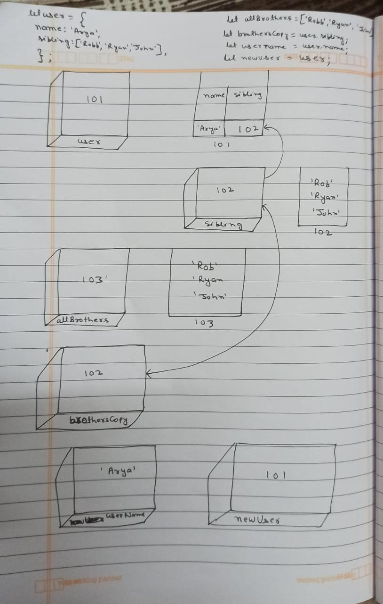

```js
let user = {
  name: 'Arya',
  sibling: ['Robb', 'Ryan', 'John'],
};
let allBrothers = ['Robb', 'Ryan', 'John'];
let brothersCopy = user.sibling;
let usename = user.name;
let newUser = user;
```

1. Memory representation

- Create the memory representation of the above snippet on notebook.
- Take a photo/screenshot and add it to the folder `code`



2. Answer the following with reason:

- `user == newUser;` // true, As value user is assigned to variable newUser hence it coppied the value of user.
- `user === newUser;`// true, As value user is assigned to variable newUser hence it coppied the value of user.
- `user.name === newUser.name;`// true, As value user is assigned to variable newUser hence it coppied the value of user.
- `user.name == newUser.name;`// true, As value user is assigned to variable newUser hence it coppied the value of user.
- `user.sibling == newUser.sibling;`// true, As value user is assigned to variable newUser hence it coppied the value of user.
- `user.sibling === newUser.sibling;`// true, As value user is assigned to variable newUser hence it coppied the value of user.
- `user.sibling == allBrothers;` // false, As variable allBorthers is an another array which will have different address.
- `user.sibling === allBrothers;` // false, As variable allBorthers is an another array which will have different address.
- `brothersCopy === allBrothers;`// false, As variable allBorthers is an another array which will have different address.
- `brothersCopy == allBrothers;`// false, As variable allBorthers is an another array which will have different address.
- `brothersCopy == user.sibling;` // true, As value of variable brothersCopy and user.sibling has same address.
- `brothersCopy === user.sibling;`// true, As value of variable brothersCopy and user.sibling has same address.
- `brothersCopy[0] === user.sibling[0];` // true, As value of variable brothersCopy and user.sibling has same address, and hence first key value of both will be same.
- `brothersCopy[1] === user.sibling[1];`// true, As value of variable brothersCopy and user.sibling has same address, and hence 2nd key value of both will be same.
- `user.sibling[1] === newUser.sibling[1];` // true, As value user is assigned to variable newUser hence it coppied the value of user.
